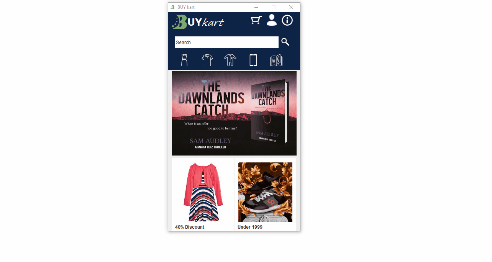

# Online-Shopping-Application
Shopping Application developed using java (swing) and integrated with database using JDBC.

### Requirements:
- JDK to run Compiled jar file.
- Java IDE (Neatbeans,etc for compiling source code)
- SQL-connector

### DEMO:

